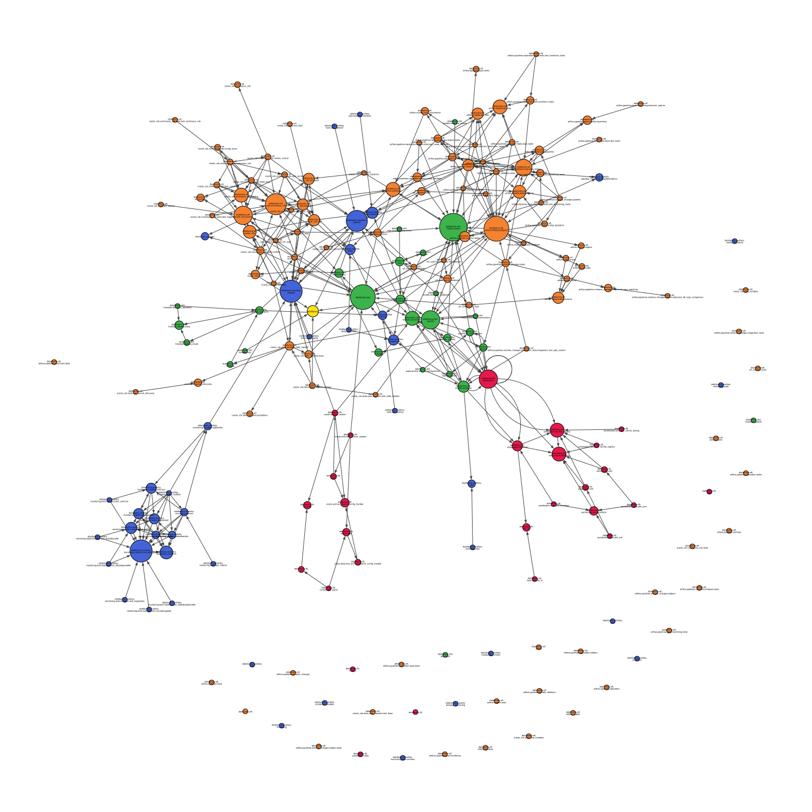

## dependency-graph
Use this module to automatically search through any repository you like and generate a dependency graph.
This module is based on python-igraph and cairo.

### How to use
There are two ways. Installing it as a regular library or using it as a pre-commit hook.

#### The regular way
Installing as regular library
```shell
cd /Where/ever/you/store/your/Projects
git clone https://github.com/frank690/dependency-graph.git
cd dependency-graph

python3 setup.py install
```

Using it accordingly
```shell
dependency_graph -r /path/to/repo/to/analyze
```

#### How to use as pre-commit hook?
Add the following to your .pre-commit-config.yaml file inside your repository.
```shell
- repo: https://github.com/frank690/dependency-graph
  rev: 0.2.1
  hooks:
    - id: dependency-graph
      args: ["--repository", "./path/to/repository/", "--level", "2"]
```

This hook is explicitly set to be used manually.
This means that the hook will not run on every commit and create a new graph.
If you want to trigger the hook and do want a new dependency graph, execute the following command.
```shell
pre-commit run --hook-stage manual dependency-graph
```

### What inputs can I use?
```shell
dependency_graph -h
```
```shell
usage: dependency_graph [-h] [-r REPOSITORY] [-o OUTPUT] [-l LEVEL] [-e [EXCLUDE [EXCLUDE ...]]]

dependency-graph that can be used to visualize the dependencies within a given repository by drawing a network graph.

optional arguments:
  -h, --help            show this help message and exit
  -r REPOSITORY, --repository REPOSITORY
                        Path to repository that should be analyzed.
  -o OUTPUT, --output OUTPUT
                        Path with extension of output file.
  -l LEVEL, --level LEVEL
                        Module name level that defines group (of nodes) coloring.
  -e [EXCLUDE [EXCLUDE ...]], --exclude [EXCLUDE [EXCLUDE ...]]
                        Define list of (sub)folders that should be ignored during the analysis.

```

### Notes
- default output is output.svg.
- default output directory will be the directory of dependency-graph repo.
- output types can be pdf, svg, png, ... .

### What does the generated dependency graph look like?

