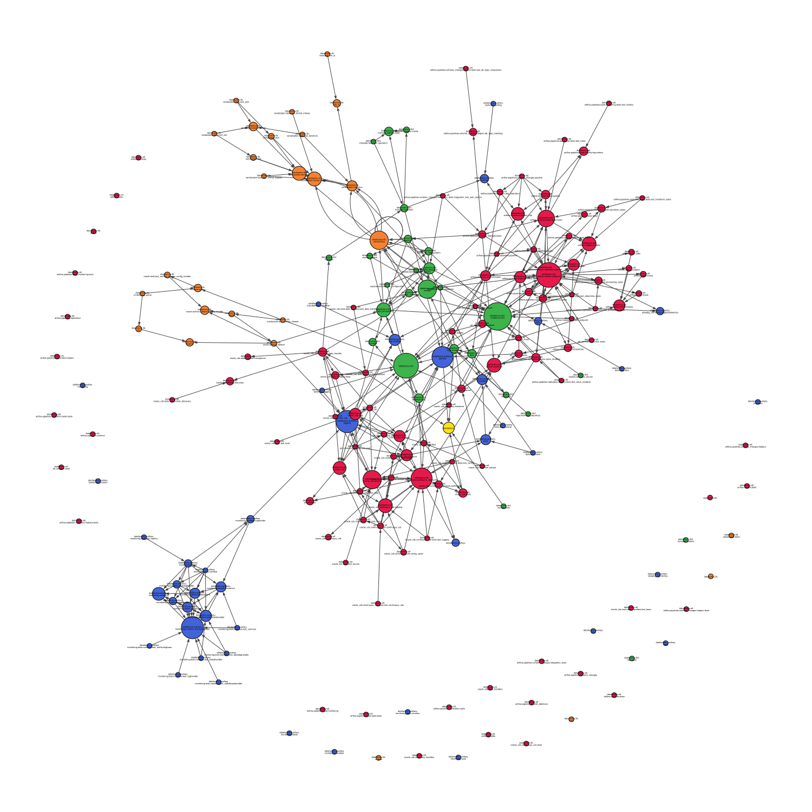

## dependency-graph
Use this module to automatically search through any repository you like and generate a dependency graph.
This module is based on python-igraph and cairo.

### How to use
There are two ways. Installing it as a regular library or using it as a pre-commit hook.

#### The regular way
Installing as regular library
```shell
cd /Where/ever/you/store/your/Projects
git clone https://github.com/frank690/dependency-graph.git
cd dependency-graph

python3 setup.py install
```

Using it accordingly
```shell
dependency_graph -r /path/to/repo/to/analyze
```

#### How to use as pre-commit hook?
Add the following to your .pre-commit-config.yaml file inside your repository.
```shell
- repo: https://github.com/frank690/dependency-graph
  rev: 0.1.6
  hooks:
    - id: dependency-graph
      args: ["--repository", "./medform/", "--level", "2"]
```

### What inputs can I use?
```shell
python3 /path/to/dependency-graph -h
```

### Notes
- default output is output.svg.
- default output directory will be the directory of dependency-graph repo.
- output types can be pdf, svg, png, ... .

### What does the generated dependency graph look like?

